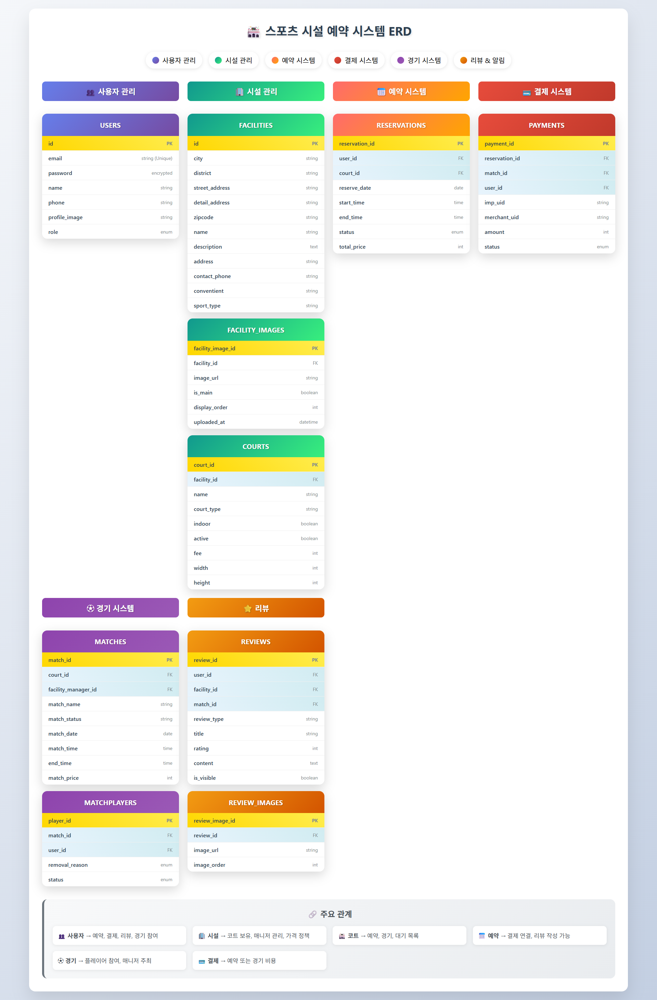

# 스포츠 예약 시스템 설계 문서

## 개발 환경 접속 정보
- H2 Console: http://localhost:8080/h2-console
- Swagger UI: http://localhost:8080/swagger-ui/index.html

## 1. 요구사항 분석

### 1.1 기능 요구사항

#### 1.1.1 사용자 관리
- 회원가입, 로그인, 프로필 관리
- 사용자 역할 구분(일반 사용자, 시설 관리자, 시스템 관리자)
- 사용자 인증 및 권한 관리
- 회원 가입 시 이메일 인증
- 비밀번호 재설정 기능

#### 1.1.2 시설/코트 관리
- 시설 정보, 사진, 위치, 가격 등록 및 관리
- 스포츠 종류별 시설 등록 및 관리
- 시설 내 여러 코트(장소) 관리
- 운영 시간, 휴무일 설정
- 가격 정책 설정 (평일/주말, 시간대별 가격 차등)

#### 1.1.3 예약 시스템
- 사용 가능 시간 조회
- 날짜/시간 선택, 예약 생성 및 취소
- 중복 예약 방지
- 예약 상태 관리 (대기, 확정, 취소, 완료 등)
- 예약 내역 조회
- 예약 상세 조회

#### 1.1.4 결제 시스템
- 온라인 결제, 환불 처리
- 결제 상태 관리
- 결제 내역 조회

#### 1.1.6 관리자 대시보드
- 예약 현황, 통계, 시설 관리
- 매출 통계
- 회원 관리
- 총 예약 수 조회
- 매치 이용자 수 조회
- 총 매출 조회

#### 1.1.7 관리자 소셜 매치
- 관리자와 관련된 시설 조회 및 관련 코트, 매니저 조회
- 매치 목록 조회
- 매치 상세 조회
- 매치 등록
- 매치 수정
- 매치 취소
- 참가자 목록 조회
- 참가자 퇴장

#### 1.1.8 소셜 매치
- 매치 등록
- 매치 신청
- 매치 목록 조회
- 매치 상세 조회
- 매치 내역 조회
- 참가자 목록 조회

#### 1.1.9 리뷰 시스템
- 시설 리뷰 평점
- 시설별 리뷰 조회
- 리뷰 등록
- 리뷰 삭제
- 리뷰 수정
- 내가 쓴 리뷰 조회

## 2. 데이터베이스 설계

### 2.1 엔티티 관계도 (ERD)


### 2.2 주요 엔티티 및 속성

#### 2.2.1 사용자(USERS)
- id (PK)
- email (Unique)
- password (암호화)
- name
- phone
- profile_image
- role (ROLE_USER, ROLE_FACILITY_MANAGER, ROLE_ADMIN)
- created_at
- updated_at
- deleted (소프트 삭제 플래그)

#### 2.2.2 시설(FACILITIES)
- id (PK)
- city
- district
- street_address
- detail_address
- zipcode
- name
- description
- address
- contact_phone
- conventient
- sport_type
- created_at
- updated_at
- deleted (소프트 삭제 플래그)

#### 2.2.3 코트(COURTS)
- court_id (PK)
- facility_id (FK)
- name
- court_type (ARTIFICIAL_TURF_BASE, ARTIFICIAL_TURF_FB, ARTIFICIAL_TURF_FUTSAL, CLAY_BASE, CLAY_TENNIS, DIRT_BASE, DIRT_FB, GRASS, HARD, NATURE_GRASS_BASE, NATURE_GRASS_FB, RUBBER_BM, RUBBER_FUTSAL, SYNTHETIC_BASKET, SYNTHETIC_BM, SYNTHETIC_FUTSAL, SYNTHETIC_TENNIS, SYNTHETIC_VOLLEY, WOODEN_BASKET, WOODEN_BM, WOODEN_VOLLEY
)
- indoor
- active
- fee
- width
- height
- created_at
- updated_at
- deleted (소프트 삭제 플래그)

#### 2.2.4 운영시간(OPERATING_HOURS)
- id (PK)
- facility_id (FK)
- day_of_week
- open_time
- close_time
- is_holiday
- created_at
- updated_at
- deleted (소프트 삭제 플래그)

#### 2.2.5 가격정책(PRICE_POLICIES)
- id (PK)
- facility_id (FK)
- court_id (FK, nullable)
- name
- day_type (WEEKDAY, WEEKEND, HOLIDAY)
- start_time
- end_time
- price
- minimum_hours
- effective_from
- effective_to
- created_at
- updated_at
- deleted (소프트 삭제 플래그)

#### 2.2.6 예약(RESERVATIONS)
- reservation_id (PK)
- user_id (FK)
- court_id (FK)
- reserve_date
- start_time
- end_time
- status (PENDING, CONFIRMED, CANCELED, COMPLETED)
- reservation_number
- cancel_reason
- canceled_at
- total_price
- created_at
- updated_at
- deleted (소프트 삭제 플래그)

#### 2.2.7 결제(PAYMENTS)
- payment_id (PK)
- reservation_id (FK)
- match_id (FK)
- user_id (FK)
- imp_uid (결제 서비스 고유번호)
- merchant_uid (주문번호)
- amount
- status (READY, PAID, CANCELED, FAILED, REFUNDED)
- pay_method
- paid_at
- canceled_at
- cancel_reason
- refund_amount
- created_at
- updated_at
- deleted (소프트 삭제 플래그)

#### 2.2.9 리뷰(REVIEWS)
- review_id (PK)
- user_id (FK)
- facility_id (FK)
- match_id (FK)
- reservation_id
- review_type
- title
- rating
- content
- is_visible
- created_at
- updated_at
- deleted (소프트 삭제 플래그)

#### 2.2.9 리뷰(REVIEW_IMAGES)
- review_image_id
- review_id (FK)
- image_url
- image_order
- created_at
- updated_at
- deleted (소프트 삭제 플래그)

#### 2.2.10 시설 이미지(FACILITY_IMAGES)
- facility_image_id (PK)
- facility_id (FK)
- image_url
- is_main
- display_order
- uploaded_at
- created_at
- updated_at
- deleted (소프트 삭제 플래그)

#### 2.2.11 소셜 매치(MATCHES)
- match_id (PK)
- court_id (FK)
- facility_manager_id(FK)
- match_name
- match_status
- description
- team_capacity
- match_date
- match_time
- end_time
- match_price
- created_at
- updated_at
- deleted (소프트 삭제 플래그)

#### 2.2.12 매치 참가자(MATCHPLAYERS)
- player_id
- match_id (FK)
- user_id (FK)
- removal_reason (ABUSIVE_BEHAVIOR, LATE, SERIOUS_RULE_VIOLATION)
- status (CANCEL, COMPLETED, KICKED, MATCH_CANCELLED, ONGOING, READY)
- created_at
- updated_at
- deleted (소프트 삭제 플래그)

#### 2.2.13 시설 관리자(FACILITY_MANAGERS)
- facility_manager_id (PK)
- facility_id (FK)
- user_id (FK)
- manager_role (MANAGER, OWNER, STAFF)
- assigned_at
- created_at
- updated_at
- deleted (소프트 삭제 플래그)

## 3. N:M 관계 매핑 테이블

### 3.1 User와 Facility 간의 관리자 관계 (N:M)
```
[USERS] --- [FACILITY_MANAGERS] --- [FACILITIES]
```

### 3.2 User와 Match 간의 참가자 관계 (N:M)
```
[USERS] --- [MATCHPLAYERS] --- [MATCHES]
```

## 4. JPA 엔티티 설계 주요 고려사항

### 4.1 N:M 관계 처리
- 모든 N:M 관계는 중간 엔티티를 통해 두 개의 1:N, N:1 관계로 분리
- 예: User와 Team 간의 N:M 관계는 TeamMember 엔티티를 통해 관리

### 4.2 상속 관계 설계
- `BaseEntity` 추상 클래스를 통한 공통 필드 관리
- `@MappedSuperclass`, `@EntityListeners(AuditingEntityListener.class)` 활용
- 소프트 삭제 구현 (`@SQLDelete`, `@Where`)

### 4.3 단방향 연관관계 우선
- 양방향보다 단방향 연관관계 우선 적용
- 필요한 경우에만 제한적으로 양방향 관계 설정
- `@ManyToMany` 관계는 사용하지 않고 중간 테이블 엔티티로 명시적 관리

### 4.4 Fetch 전략
- 기본적으로 @ManyToOne, @OneToOne은 LAZY 로딩 명시
- 성능 최적화를 위해 필요한 경우 명시적으로 FetchType 지정

### 4.5 인덱스 최적화
- 자주 조회되는 컬럼과 FK에 인덱스 적용
- 복합 인덱스 활용으로 조회 성능 향상

## 5. RESTful API 설계 (기본 CRUD 엔드포인트)

### 5.1 사용자 관리 API
- POST /api/users - 회원가입
- POST /api/auth/login - 로그인
- GET /api/users/me - 내 정보 조회
- PUT /api/users/me - 내 정보 수정
- GET /api/users/{id} - 특정 사용자 정보 조회 (관리자)
- PUT /api/users/{id} - 특정 사용자 정보 수정 (관리자)

### 5.2 시설 관리 API
- POST /api/facilities - 시설 등록
- GET /api/facilities - 시설 목록 조회
- GET /api/facilities/{id} - 시설 상세 조회
- PUT /api/facilities/{id} - 시설 정보 수정
- DELETE /api/facilities/{id} - 시설 삭제
- POST /api/facilities/{id}/images - 시설 이미지 등록

### 5.3 코트 관리 API
- POST /api/facilities/{facilityId}/courts - 코트 등록
- GET /api/facilities/{facilityId}/courts - 코트 목록 조회
- GET /api/courts/{id} - 코트 상세 조회
- PUT /api/courts/{id} - 코트 정보 수정
- DELETE /api/courts/{id} - 코트 삭제

### 5.4 예약 관리 API
- GET /reserve/{id} - 예약 상세 조회
- GET /reserve/reservations - 예약 목록 조회
- GET /reserve/verifyReservation - 예약 결제 전 검증
- PUT /reserve/cancel/{id} - 예약 취소
- GET /reserve/reserveHours - 예약 가능 시간 조회
- POST /reserve/saveReservation - 예약 대기 생성
- GET /admin/reservation/dashboardReservations - 관리자 대시보드 최근 예약
- GET /admin/reservation/reservations - 관리자 예약 현황
- GET /admin/reservation/{id} - 관리자 예약 상세
- PUT /admin/reservation/status/{id} - 관리자 예약 상태 변경
- GET /admin/reservation/getAdminTotalReservation - 관리자 총 예약 수

### 5.5 결제 API
- GET /admin/payment/getTotalRevenues - 관리자 대시보드 총 매출
- GET /payment/getPaymentHistCnt - 결제 내역 카운트
- GET /payment/paymentHist - 결제 내역 조회
- POST /payment/reservationApprove - 예약 결제 승인
- GET /payment/reservationCancelChk - 예약 결제 취소 상태 확인
- GET /payment/cancelStatus - 결제 취소 상태 확인
- GET /payment/approve - 결제 최종 승인

### 5.6 리뷰 API
- GET /review/rentInfo/{id} - 리뷰 정보 조회
- GET /review/myReviews - 내가 쓴 리뷰 목록 조회
- GET /review/myReviewCnt - 내가 쓴 리뷰 카운트
- GET /review/{id} - 리뷰 상세 조회
- POST /review/registReview - 리뷰 작성
- GET /review/${id}/reviews - 시설 리뷰 목록 조회
- PUT /review/modify/{id} - 리뷰 수정
- DELETE /review/delete/{id} - 리뷰 삭제
- GET /review/{id}/reviewInfo - 시설 리뷰 정보

### 5.7 매치 API
- POST /admin/match/getMatches - 관리자 매치 조회
- GET /admin/player/getAdminMatchPlayerCount - 관리자 대시보드 매치 총 이용자 수
- PUT /admin/player/eject/{id} - 참가자 퇴장
- POST /admin/match/registMatch - 관리자 매치 등록
- PUT /admin/match/status/{id} - 관리자 매치 상태 변경
- GET /admin/match/{id} - 관리자 매치 상세 조회
- PUT /admin/match/edit/{id} 관리자 매치 수정
- GET /admin/facilities/{id}/managers - 관리자 매니저 목록 조회
- GET /match/matchHistory - 매치 이용 내역 조회
- POST /match/matches - 매치 목록 조회
- POST /match/matcheDates - 날짜별 매치 카운트 조회
- GET /match/matches/{id} - 매치 상세 조회
- GET /player/verifyMatch - 매치 참가 요청(검증)
- PUT /player/cancelMatch - 매치 신청 취소

## 6. 보안 설계

### 6.1 인증 방식
- JWT(JSON Web Token) 기반 인증
- Access Token과 Refresh Token 사용

### 6.2 권한 관리
- Spring Security와 Custom UserDetailsService 구현

### 6.3 데이터 보안
- 비밀번호 해싱 (BCrypt)
- HTTPS 통신
- 입력 값 검증 및 방어적 코딩

## 7. 배포 및 인프라 구성

### 7.1 개발 환경
- Java 17
- Spring Boot 3.4.3
- MySQL
- Redis (캐싱, 세션 관리) 필요한 경우에만!

### 7.2 배포 환경
- Docker 컨테이너화
- CI/CD 파이프라인 구성 (GitHub Actions)
- AWS EC2

## 5. 개발 환경 설정

### 5.1 코드 포맷팅
Google Java Format을 사용하여 코드 스타일을 통일
